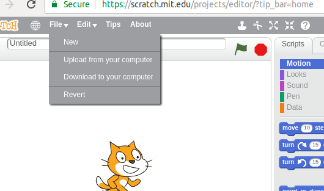
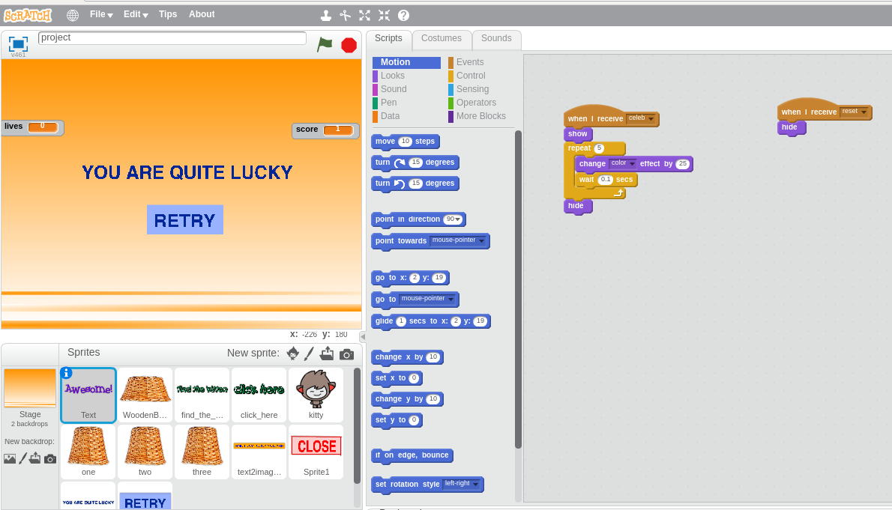

# WMP-CS50-Ujjwal0501
WMP-CS50-2017 problem set solutions

Total number of problem sets: 8

## Problem set 0
  ### Description
  A project on '[Scratch](https://scratch.mit.edu/about)' programming language.
  This is a project of 'Luck meter' game. In this user has to play the game and at the end it will tell if you are having a 'bad luck', 'quite good luck' or 'very good luck' based on the points scored by the player.  The criteria for the same has been preset in the script.

  ### How to run?
  1. Download the file named '[project.sb2](pset0/project.sb2)'.
  2. Goto [scratch website editor](https://scratch.mit.edu/projects/editor/?tip_bar=home).

  

  3. Upload the file you just downoaded using the 'Upload from computer' option. Click ok on the prompt.

  After uploading the file, the webpage should appear similar as in the image below.
  
  

  4. Use the icon in top left corner of the editor to go fullscreen. Click on the green flag to start the program.
  
